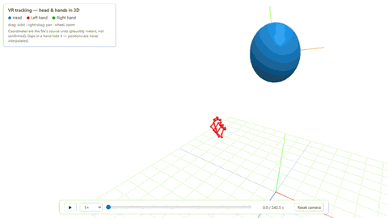
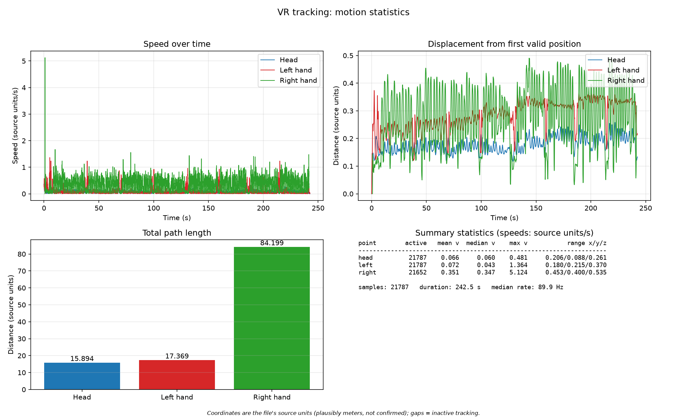
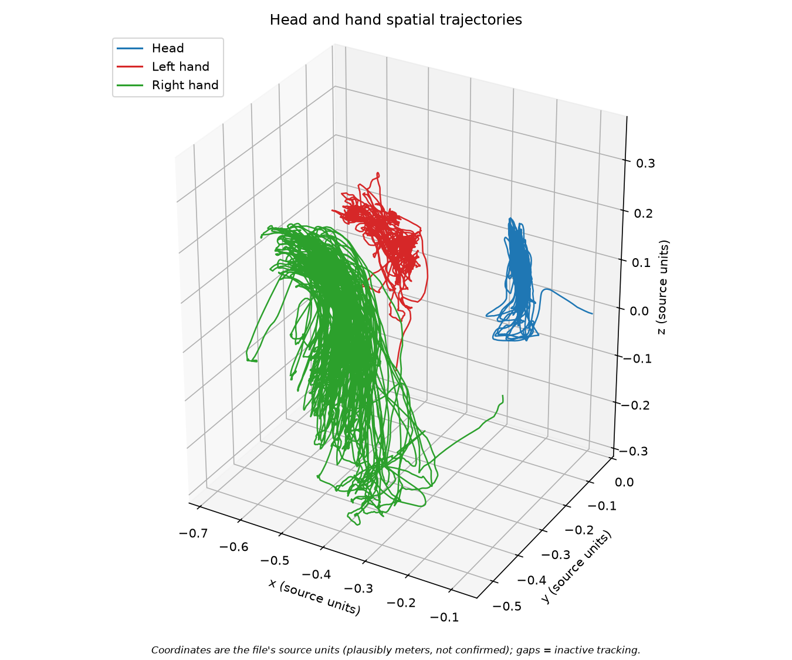
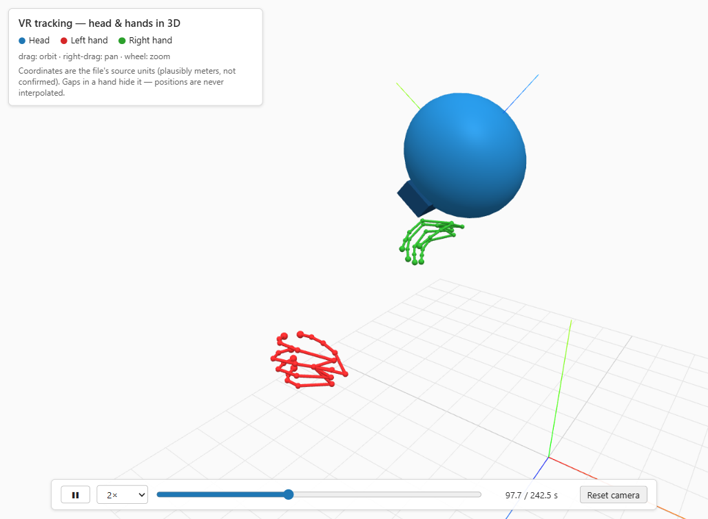

# DataLight — VR Tracking Visualization

**Русский:** [README.ru.md](README.ru.md)

Parses an unfamiliar VR tracking file and presents it three ways:

1. **Motion statistics** — speed and displacement over time, path lengths, summary table.
2. **3D trajectories** of head, left hand, and right hand — static PNG plus an interactive HTML view.
3. **Interactive 3D viewer** — real-time playback with a posed headset model and 26-joint hand skeletons.

## Demo

The interactive 3D viewer, full session (242 s) with a camera orbit:



Interactive version: [github.io/TrackingDataVisualisation](https://uran-wq.github.io/TrackingDataVisualisation/).

## Example results





Interactive version: [github.io/TrackingDataVisualisation](https://uran-wq.github.io/TrackingDataVisualisation/). (open in a browser; rotate/zoom, hover shows time).



## Input format

`trackingData_20260505_165740.txt` (258 MB), UTF-8 **JSON Lines**:

- **Line 1** is a metadata record: `notice`, `timeStampNs`, `cameraExtrinsics`, `cameraIntrinsics`.
- **Lines 2–21788** are 21,787 tracking records: `predictTime`, `appState`, `Head`, `Hand` (26 joints per hand), `Body` (24 joints), `timeStampNs`, `Input`.

**Quirk that breaks naive parsing:** pose strings (`Head.pose`, `…HandJointLocations[].p`) use a **comma as the decimal separator** *and* as the value separator — `"-0,08517717"` is the number `-0.08517717`, and a pose is 14 comma-tokens = 7 numbers (`x,y,z,qx,qy,qz,qw`). Plain `float()` fails; values must be re-assembled by merging token pairs (`src/data_loader.py:parse_locale_numbers`). The `va`/`wva` fields mix comma decimals with `E±` exponent notation, which makes token boundaries unresolvable without a spec — they are not used.

Timestamps come from `timeStampNs` (monotonic nanoseconds). `predictTime` has unverified units and is never used.

The camera recording `CameraRecord_20260505_165740.mp4` (199 MB) is **not used** — video overlay was an optional assignment approach.

### Input files are not in git

Both inputs exceed GitHub's 100 MB per-file limit, so they are `.gitignore`d. **Place both files in the repository root** (next to this README) before running.

## Install

Python 3.14 tested (any recent 3.10+ should work):

```bash
python -m venv .venv
source .venv/bin/activate        # Windows: .venv\Scripts\activate
pip install -r requirements.txt
```

## Run

From the repository root, one command:

```bash
python -m src.main --input trackingData_20260505_165740.txt --output output
```

Both arguments are optional (shown defaults). The command prints a summary and writes:

| File | Contents |
|---|---|
| `output/motion_statistics.png` | Speed, displacement, path length, summary table |
| `output/trajectory_3d.png` | Static 3D head/hand trajectories (README example) |
| `output/trajectory_3d.html` | Interactive 3D trajectories (self-contained) |
| `output/viewer/` | Interactive 3D viewer bundle (open `index.html`) |
| `output/summary_stats.json` | Machine-readable summary of the printed numbers |

## Interactive 3D viewer

Open `output/viewer/index.html` in any browser — no server and no build step (three.js r147 and all assets are vendored in the repo under `viewer/lib/`; the page loads no network resources).

- **Head:** stylized headset oriented by the recorded head quaternion (visor = the verified forward axis), with a local XYZ triad.
- **Hands:** all 26 joints as spheres, connected by the bone links verified against the data (see observations below); red = left, green = right, matching the figures.
- **Controls:** play/pause, 0.25×–4× speed, timeline scrubbing, drag to orbit, right-drag to pan, wheel to zoom, reset camera.
- **Gaps:** a hand that is inactive in the data is hidden for exactly those frames — positions are never interpolated.

## Tests

```bash
pip install pytest
python -m pytest tests -q
```

37 tests cover the fragile parts: locale-decimal parsing (using real values from the file), timestamp conversion, head/hand extraction (positions, quaternion, full joint arrays), inactive-hand gaps, speed/path math with zero `dt`, malformed/empty input, and the viewer export (downsampling, base64 payload, bundle assembly). The README command above has been run end-to-end on the full 258 MB file.

## Key observations

All numbers below are produced by the run above (units: file's source units — **plausibly meters, not confirmed**).

- **Duration/rate:** 21,787 records over 242.5 s; median sample interval 11.1 ms (≈89.9 Hz), range 6.2–67.4 ms; no non-positive time deltas.
- **Head:** path 15.9; mean/median/max speed 0.066 / 0.060 / 0.481; stays within a 0.21 × 0.09 × 0.26 box near the origin.
- **Left hand:** path 17.4; mean/median/max speed 0.072 / 0.043 / 1.364; active in all 21,787 records.
- **Right hand:** inactive for the first 0.81 s and the last 0.76 s (135 records total — real tracking gaps, plotted as breaks, never interpolated). Path 84.2 with mean speed 0.351 and max 5.12.
- **Right hand is much jitterier than the left:** median frame-to-frame step is 3.8 mm vs 0.5 mm (left) and 0.7 mm (head); 96 frames exceed 1 unit/s speed, including ~5 cm single-frame jumps right after tracking activates at t ≈ 0.8 s. Its path length is therefore noise-inflated and should not be read as purposeful travel distance.
- **Spatial layout:** head sits near the origin; both hands lie at more negative y than the head (head y ≈ −0.09, hands ≈ −0.38…−0.44), consistent with hands below head — but the axis convention is not proven, so axes are plotted exactly as stored.
- **Head orientation is usable:** applying the recorded head quaternion (x,y,z,w, head→world) to the stored pose points the face axis (local −Z) toward the recorded hand positions in **100% of frames**; the alternative w-first layout puts the hands behind the face in every frame and was rejected.
- **Hand topology verified:** the 26 joints match OpenXR-style ordering — the 21 finger/palm bone links hypothesized from that ordering stay rigid over time (relative length CV ≈ 0.013) while cross-finger control pairs vary 0.1–0.76. The viewer draws exactly those 25 bones.

## Assumptions and limitations

- **Hand position = joint 0** (the first `HandJointLocations` entry) of 26, used as the representative hand point in the statistics figures. The file carries no joint names; the OpenXR-style ordering is *verified* by the rigidity test above, but individual joints remain unnamed.
- **Units/axes are not converted.** Positions span < 1 unit from a near-head origin, which suggests meters, but the file never states units or axis orientation. No axis swap or sign flip is applied anywhere; figures label axes as "source units".
- Speeds are finite-difference estimates (`‖p[i] − p[i−1]‖ / dt`) and inherit tracking jitter, especially for the right hand.
- **Head orientation convention is inferred, not documented:** the viewer renders `Head.pose` quaternions as x,y,z,w head→world with the face at local −Z. That layout passes the data-driven test above (100% of frames), but the file itself never defines the convention.
- `va`/`wva` (ambiguous comma/exponent encoding) and `predictTime` (unknown units) are deliberately unused.
- Behavioral interpretations ("the person did X") are not attempted — three tracked points support geometric/temporal statements only.

## Difficulties

1. **Locale decimal comma inside JSON strings** — the JSON envelope parses normally, but every pose value needs pair-merging before `float()`. Solved with one tested parser function; unit tests include a real pose from the file.
2. **Unresolvable `va`/`wva` encoding** — comma decimal separator and comma field separator collide (`"0,0,0,370,054…"`). Without a spec the split is ambiguous, so these fields are excluded rather than guessed.
3. **Inactive-hand gaps** — 135 right-hand frames have no position. They are kept as NaN: plots break the line, path/speed calculations skip the boundary segments, and no position is ever fabricated.
4. **Right-hand noise** — large spikes (up to 5.1 units/s) are genuine in the data, not a parse bug; quantified above instead of smoothed away.
5. **258 MB / 199 MB inputs vs GitHub's 100 MB limit** — excluded via `.gitignore`, with placement documented here.
6. **Undocumented pose conventions** — quaternion component order, handedness, and joint ordering are never stated in the file. Each was settled by a data-driven test (face-vs-hands direction, bone rigidity) rather than assumed, and the tests are described in the observations above.
7. **Interactive viewer without a build toolchain** — kept the deliverable clone-and-open: three.js r147 (UMD) + OrbitControls vendored under `viewer/lib/`, playback exported as a base64 `Float32Array` payload in `data.js`, so `output/viewer/index.html` runs from `file://` with no npm, bundler, or local server.

## Project structure

```
.
├── README.md               # this file (English, default)
├── README.ru.md            # русская версия
├── requirements.txt        # numpy, pandas, matplotlib, plotly
├── .gitignore              # excludes the two oversized inputs, venv, caches
├── src/
│   ├── data_loader.py      # JSON Lines + locale parsing -> DataFrame, quats, joints
│   ├── analysis.py         # speed, displacement, path length, summaries
│   ├── visualization.py    # matplotlib PNGs + plotly HTML
│   ├── viewer.py           # exports output/viewer/ bundle (30 Hz payload)
│   └── main.py             # CLI: python -m src.main
├── viewer/                 # static viewer assets: index.html, app.js, lib/ (three.js)
├── media/                  # README demo: viewer_demo.gif, viewer_demo.mp4
├── tests/                  # 37 tests (pytest)
└── output/                 # figures, summary_stats.json, viewer/ bundle
```
